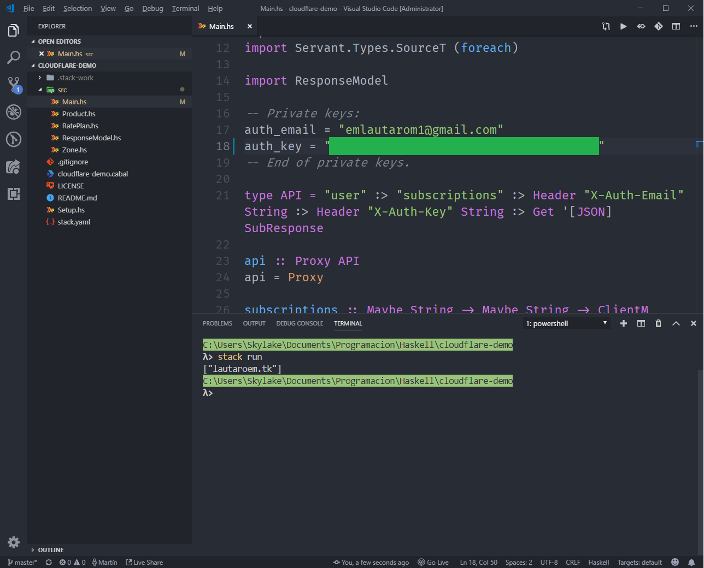

# cloudflare-demo

## Build and run

**Important:** Replace `auth_key` and `auth_email` for your own cloudflare credentials.

```bash
    > cabal run
```

# Result



*Notes:* 
 - This is an old screenshot (it uses `stack` instad of `cabal`)
 - Built and tested on `Windows 10 v1903` with `GHC 8.6.5` and `cabal 3.0.0.0`